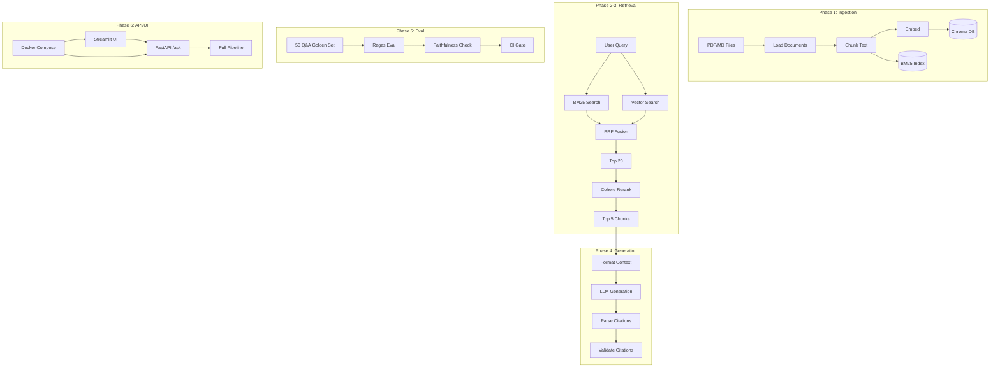

# Production RAG System — 6-Phase Implementation Plan

## Current State

The AskMyDocs project is **empty**. This plan scaffolds and implements the full system from scratch.

---

## Architecture Overview




---

## Phase 1 — Ingestion Pipeline

**Objective:** Load PDFs and Markdown, chunk, embed, and store in Chroma.

### Structure

```
src/
  ingestion/
    loaders.py      # PyPDFLoader, UnstructuredMarkdownLoader
    chunker.py      # RecursiveCharacterTextSplitter (512 tokens, 50 overlap)
    embedder.py     # OpenAI embeddings (text-embedding-3-small)
    store.py        # Chroma collection + persist path
  config.py         # chunk_size, overlap, embed_model
scripts/
  ingest.py         # CLI: python -m scripts.ingest ./docs
```

### Key Dependencies

- `chromadb`, `openai` (embeddings API), `pypdf`, `langchain`, `unstructured[md]`

### Chunking Strategy

- **RecursiveCharacterTextSplitter** with chunk_size=512, overlap=50 (tunable)
- Preserve paragraph boundaries where possible to keep context intact

### Embeddings

- OpenAI `text-embedding-3-small`; requires `OPENAI_API_KEY` env var

### Done-When Validation

- Unit test: `test_ingestion_returns_chunks` — load sample PDF, verify chunks stored in Chroma
- Integration: Run `ingest docs/`, query Chroma for a known phrase, confirm correct chunks returned

---

## Phase 2 — Hybrid Retrieval

**Objective:** Combine BM25 (keyword) + vector (semantic) and fuse with RRF.

### Structure

```
src/
  retrieval/
    bm25.py         # Build BM25 index from chunks at ingest time
    vector.py       # Chroma similarity search
    hybrid.py       # RRF fusion (k=60 typical)
```

### Implementation

- **BM25**: Use `rank_bm25` to index chunk texts; store index alongside Chroma (pickle or disk)
- **RRF Formula**: `score(d) = sum(1 / (k + rank_i(d)))` with k=60; merge and deduplicate by chunk ID
- Run BM25 and vector search in parallel; each returns top-20; fuse to get top-20 merged

### Done-When Validation

- Create `tests/retrieval/` with 10 hand-labeled test queries
- Metric: recall@10 for hybrid vs BM25-only vs vector-only; hybrid must beat both

---

## Phase 3 — Reranking

**Objective:** Send top-20 fused results to Cohere Rerank, keep top-5.

### Structure

```
src/
  retrieval/
    reranker.py     # Cohere rerank call (model=rerank-v4.0-pro, top_n=5)
```

### Implementation

- Cohere client: `co.rerank(model="rerank-v4.0-pro", query=..., documents=chunk_texts, top_n=5)`
- Documents passed as list of strings (chunk text)
- Requires `COHERE_API_KEY` env var

### Done-When Validation

- Manual: Compare top-5 before vs after rerank; top result should be visibly more relevant

---

## Phase 4 — Generation + Citations

**Objective:** LLM answers only from retrieved docs, with `[1][2]` citations; zero hallucinated answers.

### Structure

```
src/
  generation/
    formatter.py    # Format context as "[1] chunk1... [2] chunk2..."
    prompt.py       # System + user prompt enforcing citation rules
    llm.py          # Anthropic client (Claude)
    parser.py       # Extract [1][2] from response, map to chunks
    validator.py    # Assert every citation exists, no unsupported claims
```

### Citation Flow

1. Format context: `[1] {chunk_1}\n[2] {chunk_2}` ...
2. Prompt: "Answer only using the provided context. Cite with [N]. Do not add information not in the context."
3. Parse response for `[N]` patterns
4. Validate: each cited N maps to a chunk; optionally use Ragas-style claim extraction for stricter checks

### Done-When Validation

- 20 test questions with known answers; assert no hallucinated facts and all claims cite valid chunks

---

## Phase 5 — Ragas Eval + CI Gate

**Objective:** Golden dataset (50 Q&A pairs), Ragas scores, GitHub Actions gate on faithfulness ≥ 0.85.

### Structure

```
data/
  golden_qa.jsonl   # 50 Q&A pairs — template provided; you populate manually or generate elsewhere
  golden_qa.example.jsonl  # Schema: {"question", "answer", "contexts", "ground_truth"} per line
tests/
  test_ragas_ci.py  # Ragas evaluate + assert faithfulness >= 0.85
.github/
  workflows/
    ragas-eval.yml  # Run on PR/push; fail if faithfulness < 0.85
```

### Ragas Setup

- Provide `data/golden_qa.example.jsonl` schema and empty `data/golden_qa.jsonl` template
- You populate 50 Q&A pairs manually or via external tool (question, answer, contexts, ground_truth)
- `evaluate(dataset, metrics=[faithfulness, answer_relevancy], in_ci=True)`
- `assert result["faithfulness"] >= 0.85`

### Done-When Validation

- CI fails when faithfulness drops below 0.85 (e.g., by temporarily breaking retrieval)

---

## Phase 6 — API + UI + Docker

**Objective:** FastAPI `/ask`, Streamlit UI, `docker compose up` yields a working app.

### Structure

```
api/
  main.py           # FastAPI app, /ask POST {question}, /ingest POST {files}
  dependencies.py   # Shared RAG pipeline instance
ui/
  app.py            # Streamlit: upload docs, ask questions, show cited answers
docker/
  Dockerfile.api    # Python + FastAPI
  Dockerfile.ui     # Python + Streamlit
docker-compose.yml  # api + ui + chroma persistence
```

### API Contract

- `POST /ask` — `{"question": "..."}` → `{"answer": "...", "citations": [{"chunk_id": ..., "text": "..."}]}`
- `POST /ingest` — multipart file upload → trigger ingestion

### Docker Compose

- Services: `api`, `ui`; volume for Chroma DB; env: `COHERE_API_KEY`, `OPENAI_API_KEY`, `ANTHROPIC_API_KEY`

### Done-When Validation

- `docker compose up` → UI loads, user can ask a question and get cited answer

---

## Dependencies Summary


| Phase | Packages                                         |
| ----- | ------------------------------------------------ |
| 1     | chromadb, openai, pypdf, langchain, unstructured |
| 2     | rank_bm25                                        |
| 3     | cohere                                           |
| 4     | anthropic                                        |
| 5     | ragas, datasets, pytest                          |
| 6     | fastapi, uvicorn, streamlit                      |


---

## Suggested Order

1. **Phase 1** — Foundation; everything else depends on it
2. **Phase 2** — Retrieval quality
3. **Phase 3** — Reranking
4. **Phase 4** — Generation and citations
5. **Phase 5** — Eval and CI (needs pipeline working; build golden set incrementally)
6. **Phase 6** — API, UI, Docker

---

## Resolved Decisions

- **LLM**: Anthropic (Claude)
- **Embeddings**: OpenAI API (text-embedding-3-small); requires `OPENAI_API_KEY`
- **Golden dataset**: Template/schema provided; you populate 50 Q&A pairs manually or generate elsewhere
