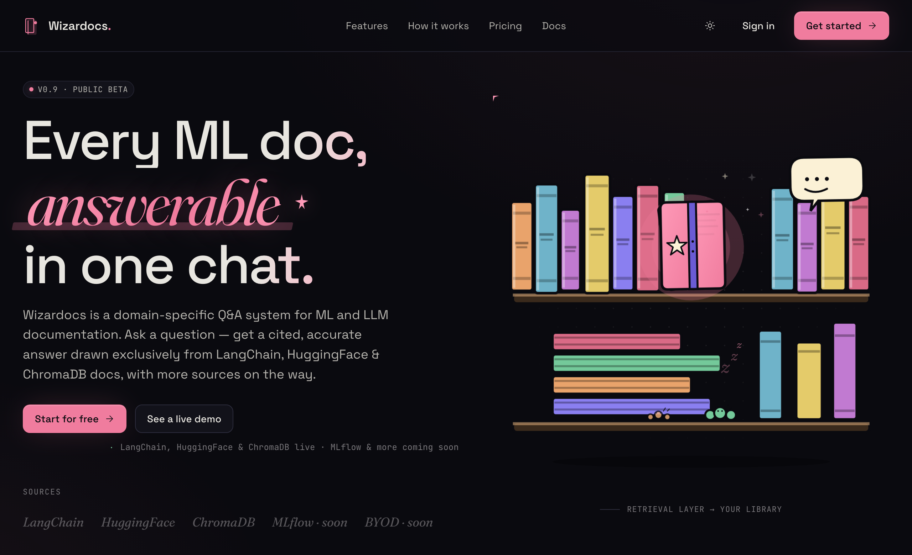
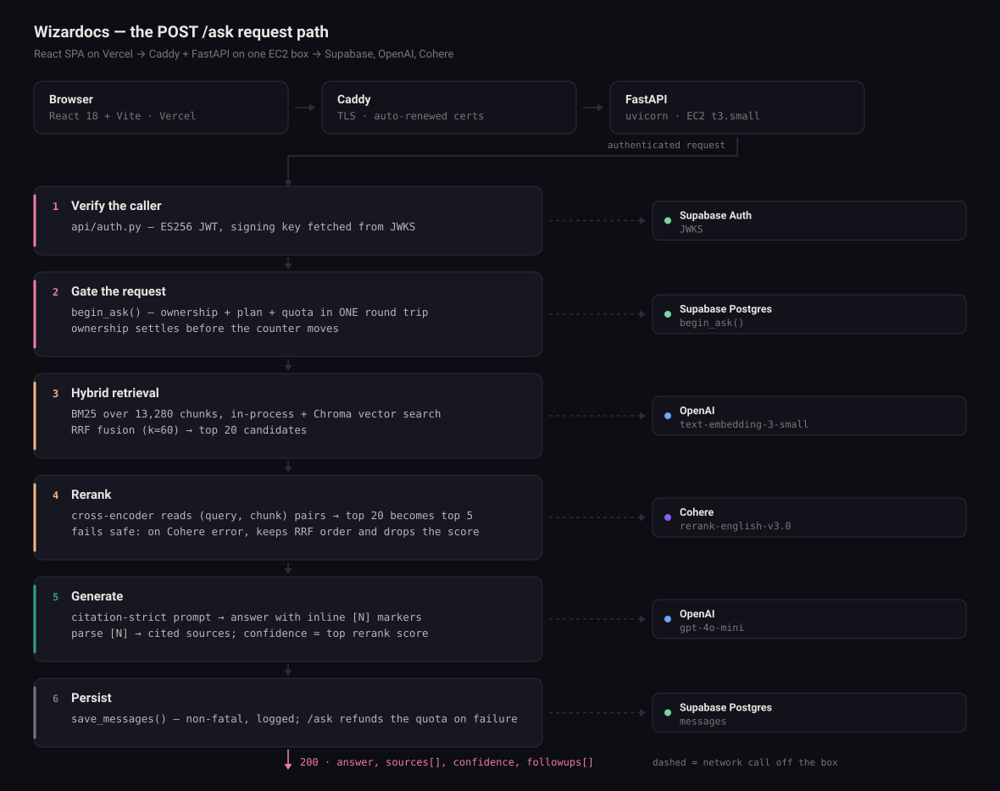

# Wizardocs

A RAG-powered Q&A system for ML and LLM documentation. Ask a question, get a cited answer grounded in real docs - with source links you can verify.

[](https://github.com/abuqaiselegant/AskWizardocs/actions/workflows/tests.yml)

**[Live app](https://ask-wizardocs.vercel.app)** · **[API health](https://wizardocs.duckdns.org/health)** · Frontend on Vercel, backend on AWS EC2

**Live sources:** LangChain, HuggingFace (7 libraries), ChromaDB - 13,280 indexed chunks



<!-- DEMO CLIP — the one thing that can't be captured headlessly.
     The chat view is behind Google OAuth (app.jsx guards "chat" and "profile"),
     and the SPA has no URL routing, so there is no page to screenshot into.

     To add it:
       1. Sign in at https://ask-wizardocs.vercel.app
       2. Cmd+Shift+5 → "Record Selected Portion" over the chat pane. ~30 s:
          pick a source chip, ask a question, let citations render, hover a [N]
          pill to pop the source card, click a follow-up.
       3. Drag the .mov straight into the GitHub web editor for this README.
          GitHub hosts it and renders a player — no GIF conversion, better
          quality, smaller file than a GIF. Paste the generated line here.
-->

---

## Architecture

One question, end to end — every hop, and every service the box talks to.



The diagram is generated by [`docs/architecture.py`](docs/architecture.py) (stdlib
only, `python docs/architecture.py`) so the labels can't drift away from the
coordinates. Edit the `stages` list and re-run.

---

## What it does

- Hybrid retrieval — BM25 keyword search + vector search, fused with RRF
- Cross-encoder reranking via Cohere (top 20 → top 5)
- GPT-4o-mini generates answers with inline citations `[1]`, `[2]`
- Streamed answers — server-sent events, so text appears as it is written
- Source selector — filter answers to one doc source or search all at once
- Confidence meter — real reranker score (0–1), not a proxy
- Context-aware follow-up suggestions per answer
- Multi-turn conversation with history-aware retrieval

---

## Stack

| Layer | Tech |
|---|---|
| Frontend | React 18 + Vite, marked.js |
| Backend | FastAPI, Python 3.12 |
| Vector store | ChromaDB (local, file-based) |
| Embeddings | OpenAI `text-embedding-3-small` |
| LLM | GPT-4o-mini |
| Reranker | Cohere `rerank-english-v3.0` |
| Auth | Supabase (Google OAuth, ES256 JWT) |
| Database | Supabase Postgres |

---

## Project structure

```
api/
  main.py               — FastAPI app: /ask, /chats, /profile, /health
  auth.py               — JWT verification via Supabase JWKS
  db.py                 — Supabase REST helpers

src/
  retrieval/
    bm25_retriever.py   — BM25 keyword search with optional source filter
    vector_retriever.py — ChromaDB semantic search with optional source filter
    hybrid_retriever.py — RRF fusion of BM25 + vector
    reranker.py         — Cohere cross-encoder reranker
  generation/
    generator.py        — Full pipeline: retrieve → rerank → generate
    llm.py              — GPT-4o-mini: answer + follow-up generation
    prompt.py           — Citation-strict system prompt
    formatter.py        — Formats chunks into numbered context blocks
    parser.py           — Extracts cited sources from answer text

scripts/
  langchain/            — HTML pipeline: sitemap → download → parse → chunk → embed
  huggingface/          — GitHub markdown pipeline + generic sitemap ingestion script

frontend/src/
  main.jsx              — Vite entry: mounts <App/>
  app.jsx               — Auth-aware router
  chat.jsx              — Chat UI: source selector, citations, confidence, history
  landing.jsx           — Marketing / landing page
  profile.jsx           — User stats and settings
  config.js             — API_BASE from VITE_API_BASE
  supabase.js           — Shared Supabase client
```

---

## How the RAG pipeline works

```
User question + source filter
        │
        ├─ [1] Query enrichment
        │       Prepend last user turn for follow-up questions
        │       so "explain more" has retrievable keywords
        │
        ├─ [2] Hybrid retrieval
        │       BM25  (top 20) ──┐
        │                        ├── RRF fusion → top 20 candidates
        │       Vector (top 20) ─┘
        │       (both filtered by source if set)
        │
        ├─ [3] Cohere reranker
        │       Cross-encoder reads (query, chunk) pairs → true relevance score
        │       Top 20 → top 5 chunks, each scored 0–1
        │
        ├─ [4] GPT-4o-mini
        │       Grounded answer with [N] inline citations
        │       Confidence = top chunk reranker score
        │
        └─ [5] Follow-ups
                Second GPT call → 3 context-specific suggested questions
```

### Buffered vs streamed

`POST /ask` returns the finished object. `POST /ask/stream` runs the identical
pipeline and emits server-sent events instead:

```
event: meta     {"confidence": 0.91}       once, before any text
event: delta    "the next fragment"        many, concatenate for the answer
event: done     {sources, followups, ...}  once, after generation
```

Steps [1]–[3] cannot stream — retrieval and reranking have to finish before a
first token exists. That is also when the confidence is known, since it is the
top chunk's reranker score and owes nothing to the generated text, so `meta`
carries it and the meter renders before the first word arrives.

Because the status line is already sent once a stream opens, quota and ownership
are settled *before* the response begins, and a mid-stream failure arrives as an
`error` event on a 200 rather than a 503.

---

## Local setup

**Prerequisites:** Python 3.12, Supabase project, OpenAI API key, Cohere API key

```bash
git clone https://github.com/abuqaiselegant/AskWizardocs
cd AskWizardocs
python -m venv venv && source venv/bin/activate
pip install -r requirements.txt
```

Create `.env`:
```
OPENAI_API_KEY=...
COHERE_API_KEY=...
SUPABASE_URL=...
SUPABASE_ANON_KEY=...
SUPABASE_SERVICE_ROLE_KEY=...
```

Start the API:
```bash
uvicorn api.main:app --reload
```

Create `frontend/.env.development`:
```
VITE_API_BASE=http://localhost:8000
VITE_SUPABASE_URL=https://your-project-id.supabase.co
VITE_SUPABASE_ANON_KEY=eyJ...
```

The anon key is public by design — it ships in the browser bundle, and row-level
security is what protects the data — but no env file is committed, so this one is
yours to create. Production values are set as Vercel environment variables.

Start the frontend (separate terminal):
```bash
cd frontend && npm install && npm run dev
```

Open the URL Vite prints (`http://localhost:5173`). The API is separate, at
`http://localhost:8000`.

---

## Adding a new doc source

**From any website with a sitemap:**
```bash
python scripts/huggingface/ingest_source.py \
  --source mylib \
  --sitemap-url https://docs.mylib.com/sitemap.xml
```

**From GitHub markdown files:**
```bash
# Add the library to LIBRARIES in scripts/huggingface/ingest_github_docs.py, then:
python scripts/huggingface/ingest_github_docs.py
```

After ingestion: restart the server so BM25 reloads `chunks.jsonl`, then set `live: true` for the new source in `frontend/src/chat.jsx`.

---

## Indexed sources

| Source | Chunks | Method |
|---|---|---|
| LangChain | 3,235 | HTML scraping — 700+ pages |
| HuggingFace | 9,560 | GitHub markdown — Hub, Transformers, PEFT, TRL, Diffusers, Smolagents, Accelerate |
| ChromaDB | 485 | HTML scraping — 169 pages |
| **Total** | **13,280** | |
